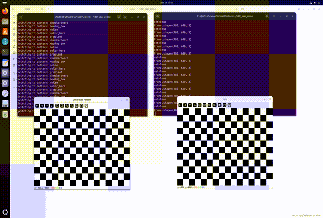

# 1 最小Linux驱动

## 1.1 Readme

本仓库为各需求下~~最简~~Linux驱动的实现，尽可能地保持正确与精简。
可配合[h13-0/Notebooks](https://github.com/h13-0/Notebooks)使用。

当前已实现：
- V4L2子系统：
	- video设备：
		- 最小摄像头驱动
		- 最小m2m设备驱动(与视频回环设备类似，但是是单进程内，通常用于编解码)
		- [视频回环设备](./V4L2/video_device/vloop.md)(虚拟摄像头，自定义摄像头画面，左为输入进程，右为摄像头画面)
			
- 平台设备：
	- 最小平台设备示例

# 2 编译方法

由于Linux内核接口会随时间演进，而本仓库是驱动入门Demo，因此不会在代码中引入复杂的版本判定机制，具体版本号以下方规定为准。

内核版本要求与兼容性问题：
- 内核版本大于等于 `6.13-rc2` 可正常编译
- 内核版本小于 `6.13-rc2` 时， `platform_driver.remove` 系列回调函数不兼容，编译错误

## 2.1 基于当前内核和头文件包

基于当前内核和头文件包的编译应按照如下的步骤进行：
1. 确保如下的包已被安装(可使用 `apt` 等工具直接安装)：
	- `linux-headers-$(uname -r)`
2. 进入本仓库根目录，运行 `make`
3. 进入各源文件对应目录，即可找到对应的 `*.ko` 文件
测试方法可见各驱动对应的 `*.md` 文件。

## 2.2 从源码重新编译内核并安装

不推荐，可考虑将本项目复制到内核源码中，并修改内核源码的Makefile，从而包含要编译的驱动源文件。

# 3 项目对应八股

由于本项目实际上为笔记[h13-0/Notebooks](https://github.com/h13-0/Notebooks)中的独立子章节，因此基础类八股并入，项目相关的机制类八股则保留到各驱动对应的文档中。

基础类八股可通过如下两种方式访问：
- Web访问：每日utc+8 0:00左右开始拉取仓库并更新。
- Obsidian本地访问：更新即时，但需要使用git进行更新
